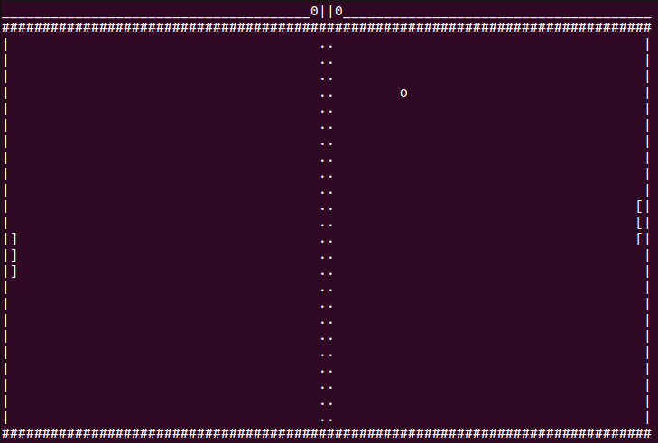

# Console application: Pong game

Here you can find two realizaition: step by step and real time

- Step by step: pong.c

- Real time: pong_bonus.c

## Available operating systems
- macos
- linux

## How to start?

Open your Terminal and

If you wont run pong.c print: 

    gcc pong.c
    
    ./a.out

If you wont run pong_bonus.c print: 

    gcc -lncurses pong_bonus.c
    
    ./a.out

## How to play?

- First player: up/down - a/z

- Second player: up/down - k/m
 
The game will end when one of the players reaches 21 points or you can press Ctrl + C to exit. 
